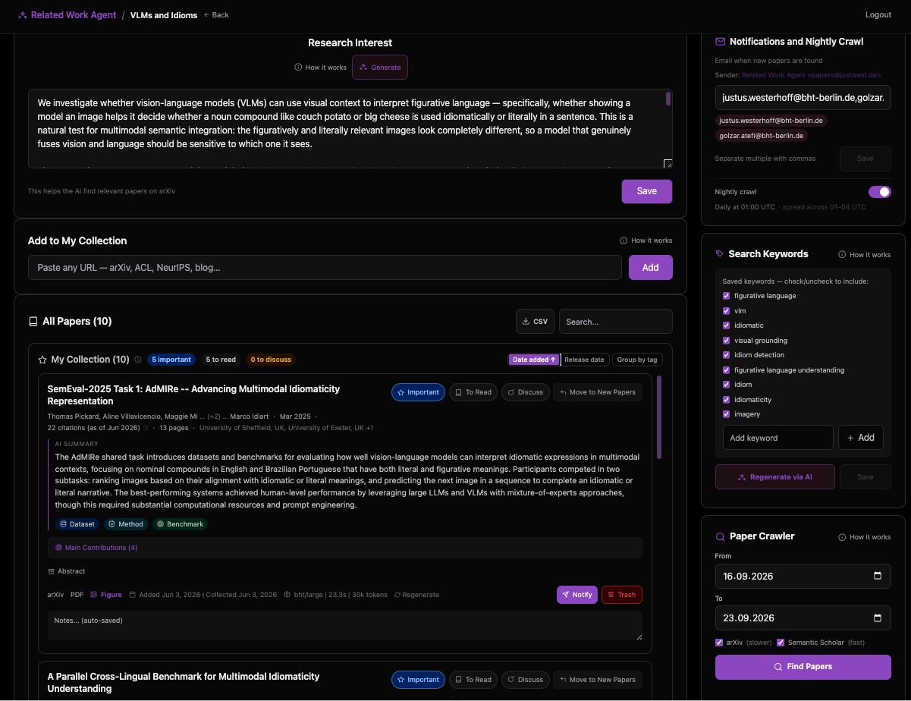
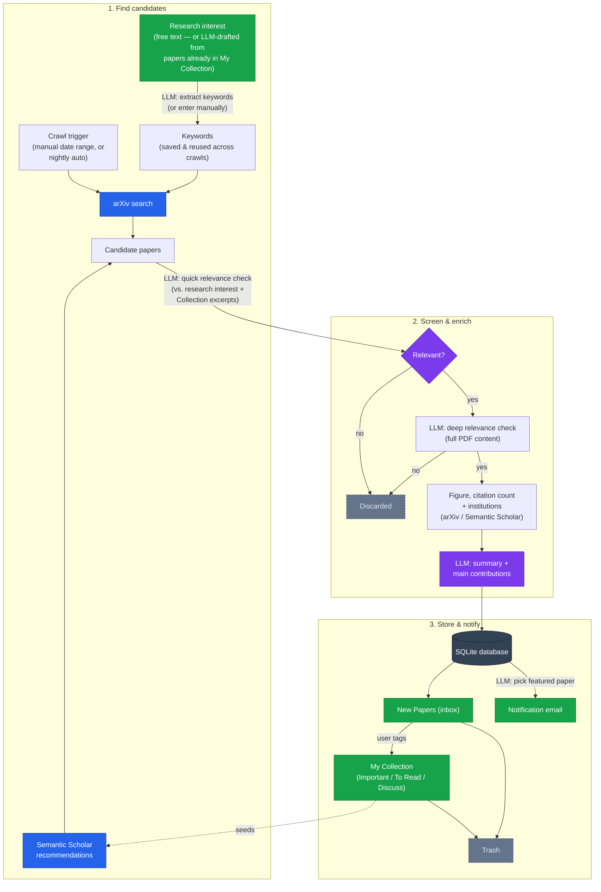

# Related Work Agent



A free, open-source, self-hosted **literature review assistant**. It tracks multiple research projects at once — each with its own research interest, keywords, and nightly crawl schedule — crawling arXiv and Semantic Scholar, screening candidates with an LLM, and surfacing **everything you need to judge a paper in seconds**: a brief AI summary, figure 1, a direct PDF link, citation count, author affiliations. New papers land in an always-up-to-date database and get emailed to you, so keeping up with your field stays fun instead of overwhelming — even with how much gets published these days.

All it needs to run is any LLM that speaks the standard chat-completions API — that can be a small locally-hosted model just as well as a large one; we've only tested at the scale described below, but nothing about the tool requires it.

## Why this exists

I built this initially only for myself to solve a pressing real problem: staying on top of a fast-moving subfield without spending an hour a day on arXiv, without getting too biased by LinkedIn hype trains, and — just as often — to onboard fast onto a new topic when I only had one or two papers as leads.

Personally, we'd gotten curious about LLM anatomy after reading dnhkng's [Rys post](https://dnhkng.github.io/posts/rys/). A few weeks of automated crawling later, our instance of this agent surfaced [arXiv:2606.06574](https://arxiv.org/abs/2606.06574) — a paper we probably wouldn't have found by manually searching, given how little visibility it had (few stars on its GitHub repo, for example). That paper turned into a real research thread, which led to our own work, [RE-PoLar](https://datexis.github.io/RE-PoLar/).

## Our setup

We've been running this in production at Berliner Hochschule für Technik (BHT) (thanks, [RIS](https://labor.bht-berlin.de/ris)!) against a real self-hosted LLM since ~mid-2026, handling multiple concurrent research projects with nightly automated crawls. Concretely, here's what we actually run:

- **Model**: a quantized [MiniMax M2.7](https://huggingface.co/cyankiwi/MiniMax-M2.7-AWQ-4bit) deployment, self-hosted on one DGX node (8× A100, 40GB each) via vLLM.
- **App deployment**: Kubernetes (single-replica Deployment + CronJob sharing one SQLite database on a PVC), Docker image built from the included `Dockerfile`.

None of that is required to run this tool — see [Quick start](#quick-start) below for pointing it at any endpoint that speaks the same standard API (a self-hosted vLLM/Ollama/llama.cpp server, or a completely different setup entirely).

## How it works



The dashed edge is a feedback loop: papers you've already curated into My Collection seed Semantic Scholar's recommendations directly. Collection papers also quietly inform two LLM steps not drawn above — keyword extraction and relevance screening both get calibration excerpts from your Collection too — so **the tool gets better targeted the more you curate**.

Every LLM step is a plain prompt template in [`app/prompts.py`](app/prompts.py). For example, the relevance check that filters candidate papers:

```
Evaluate if this paper is relevant for the research project.

Research interest:
{research_interest}

{ref_text}

Candidate paper:
Title: {title}
Abstract: {abstract}

Return JSON only: {"relevant": true} or {"relevant": false}
```

`{ref_text}` is up to `REFERENCE_PAPERS_LIMIT` papers (default 15, configurable) from your "My Collection" for that project — each as its title plus the first 400 characters of its abstract — included so the LLM has concrete calibration examples of what "relevant" means to you beyond the free-text description. Selected by tag priority (`important` → `to_discuss` → `to_read` → untagged), then filled with an even mix of your newest and oldest additions once a tier runs out of room. The same selection feeds keyword extraction and research-interest generation/refinement too. All prompt templates live in that one file — tune them there, nowhere else. Direct links to each, mapped to the diagram above:

| Diagram step                                                   | Prompt                                                                                                 |
| -------------------------------------------------------------- | ------------------------------------------------------------------------------------------------------ |
| Research interest from Collection                              | [`RESEARCH_INTEREST_FROM_COLLECTION`](app/prompts.py#L86-L101)                                         |
| Extract keywords                                               | [`KEYWORD_EXTRACTION`](app/prompts.py#L6-L18)                                                          |
| Quick relevance check                                          | [`RELEVANCE_QUICK`](app/prompts.py#L20-L32)                                                            |
| Deep relevance check                                           | [`RELEVANCE_DEEP`](app/prompts.py#L34-L50)                                                             |
| Summary + main contributions                                   | [`SUMMARY_WITH_FULL_CONTENT`](app/prompts.py#L52-L71) / [`MAIN_CONTRIBUTIONS`](app/prompts.py#L73-L84) |
| Institutions (LLM fallback, batched after all papers screened) | [`INSTITUTION_EXTRACTION`](app/prompts.py#L117-L126)                                                   |
| Pick featured paper                                            | [`FEATURED_PAPER_SELECTION`](app/prompts.py#L103-L115)                                                 |

## Quick start

```bash
git clone <this-repo>
cd paper-agent

python3.11 -m venv .venv   # must be 3.11
source .venv/bin/activate
pip install -r requirements.txt

cp .env.example .env
# edit .env: set LLM_API_BASE / LLM_API_KEY / LLM_MODELS to point at any
# endpoint that speaks the standard chat-completions API (a self-hosted
# vLLM/Ollama/llama.cpp server, or a gateway in front of one), plus
# SECRET_KEY and SITE_PASSWORD

LOG_LLM=1 .venv/bin/python -m flask run --port 5001
```

Open `http://localhost:5001`, log in with `SITE_PASSWORD`, create a project, describe your research interest, and hit "Start crawl."

## Configuration

All configuration is via environment variables — see [`.env.example`](.env.example) for the full list with explanations. The ones that matter most:

| Variable                           | Required | What it does                                                                               |
| ---------------------------------- | -------- | ------------------------------------------------------------------------------------------ |
| `LLM_API_BASE`                     | yes      | Base URL of a standard chat-completions endpoint (vLLM, Ollama, etc.)                      |
| `LLM_API_KEY`                      | yes      | API key for that endpoint                                                                  |
| `LLM_MODELS`                       | yes      | Comma-separated model names, tried in order as a fallback cascade                          |
| `SECRET_KEY`                       | yes      | Flask session secret                                                                       |
| `SITE_PASSWORD`                    | yes      | Single shared password for the whole site                                                  |
| `SCHOLAR_API_KEY`                  | no       | Semantic Scholar API key — without it, Scholar calls are unauthenticated (rate-limit risk) |
| `RESEND_API_KEY` / `NOTIFIER_TYPE` | no       | Email notifications — see `.env.example` for the SMTP fallback option                      |

## Deployment

Docker image + Kubernetes manifests are included. The web server (gunicorn, single worker process — see `AGENTS.md` for why) and the nightly crawl (CronJob) share one SQLite database on a PVC.

```bash
docker build -t <your-registry>/<your-image>:latest .
docker push <your-registry>/<your-image>:latest
```

Copy the example manifests and fill in your own registry, ingress host, and secrets:

```bash
cp k8s/deployment.yaml.example k8s/deployment.yaml
cp k8s/cronjob.yaml.example k8s/cronjob.yaml
cp k8s/ingress.yaml.example k8s/ingress.yaml
cp k8s/secret.yaml.example k8s/secret.yaml
cp k8s/backup-cronjob.yaml.example k8s/backup-cronjob.yaml
```

Then:

```bash
kubectl apply -f k8s/pvc.yaml
kubectl apply -f k8s/backup-pvc.yaml
kubectl apply -f k8s/secret.yaml
kubectl apply -f k8s/deployment.yaml
kubectl apply -f k8s/service.yaml
kubectl apply -f k8s/ingress.yaml
kubectl apply -f k8s/cronjob.yaml
kubectl apply -f k8s/backup-cronjob.yaml
```

### Backups

`related-work-db-backup` is a separate daily CronJob (`k8s/backup-cronjob.yaml.example`, `scripts/backup_db.py`) that snapshots the live database onto its own PVC (`k8s/backup-pvc.yaml`, 10Gi by default) — a separate volume so a lost or corrupted main volume doesn't take the backups down with it too. It uses SQLite's own [online backup API](https://www.sqlite.org/backup.html) rather than a plain file copy, which matters because the app runs in WAL mode (`PRAGMA journal_mode=WAL`): a raw `cp` of the `.db` file can miss recently-committed data that's still sitting in the `-wal` file, or catch the file mid-checkpoint. Each snapshot is verified (`PRAGMA integrity_check` + a row count) immediately after it's written, and old snapshots are pruned once they exceed `BACKUP_RETENTION_DAYS` (default 30). Re-running on the same day is a no-op, so the job schedule doesn't need to be exactly once/day to stay correct.

To restore: stop writes to the app (scale the Deployment to 0 replicas and suspend the crawl CronJob), copy the desired dated snapshot from the backups PVC over the live DB file via the toolpod, then scale back up. This is a manual, deliberate action — not scripted — since restoring is destructive to whatever's currently in the live DB.

Schema migrations run automatically on startup (plain `ALTER TABLE` statements, no Alembic — see `AGENTS.md`). To redeploy after a code change:

```bash
docker build -t <your-registry>/<your-image>:latest .
docker push <your-registry>/<your-image>:latest
kubectl rollout restart deployment/related-work
```

The CronJob always pulls `:latest` at job start, so it needs no separate restart. To test the nightly crawl without waiting for its schedule, run `scripts/nightly_crawl.py` directly with `CRAWL_HOUR_OVERRIDE=all` set (bypasses the per-project hour filter).

## Contributing

See [`AGENTS.md`](AGENTS.md) for repo conventions, dev commands, and an architecture deep-dive — written for both human and AI-agent contributors.

## License

[MIT](LICENSE)
